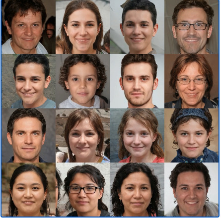

# wav2lip-test
Test for wav2lip

# References
- [ml4a](https://github.com/ml4a/ml4a/)
- [moviepy](https://zulko.github.io/moviepy/)
- [Wav2Lip Sample in ml4a](https://github.com/ml4a/ml4a/blob/master/examples/models/Wav2Lip.ipynb)
